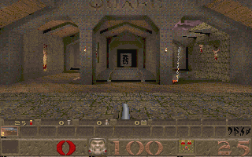

# Quake for RP2350 — 基于 MG24Quake 的移植

面向 **RP2350B / Pimoroni Explorer、16 MiB Flash、无外部 RAM** 的 Quake 单人游戏移植，同时提供 macOS SDL 测试工程和 PAK 离线资源编译工具。

保留 MG24Quake 的优化软件渲染器，将不可变资源在电脑上预先展开、去重并固定到 XIP Flash；运行时不再逐关擦写 Flash，也不使用 MG24 的 SRAM 短指针压缩。项目正在进行实机验证，尚未完成逐关通关测试。



*320×200 游戏画面：实际链接的 RP2350 ARM 固件在指令仿真中输出；外围设备由测试工具替代，并非实机拍摄或性能测试。*

## 工程来源与致谢

本工程是在现有移植上继续开发，初始来源为 **[next-hack/MG24Quake](https://github.com/next-hack/MG24Quake)**，作者 **Nicola Wrachien（next-hack）**。该项目将 Quake 移植到 Silicon Labs EFR32MG24/MGM240，并针对约 276 KiB RAM 深度优化了渲染、资源及游戏状态布局。原版基于 **id Software 的 Quake / WinQuake** 与 SDLQuake。

- 本仓库保留了上游代码与提交历史；[原版 README](docs/UPSTREAM_README.md)作为历史说明保存，其硬件、资源格式和功能声明不代表当前 RP2350 版本。
- 本次移植新增 RP2350 双核外围服务、Mac SDL 测试工程、离线原生资源编译器，以及固件和资源的独立 UF2 生成/验证流程。
- LCD 行缓冲、按键及音频服务的实现参考了本地 `pico8c` 工程。
- 保留各文件版权与许可证声明，参见 [仓库 LICENSE](LICENSE)及 [Quake 引擎 COPYING](QuakeMG24/Quake/COPYING)。游戏 PAK 数据与源代码许可证分开，请自行准备合法取得的游戏资源。

## 移植设计

- **core0**：游戏逻辑、本地 server/client、碰撞、编译为 C 的 QuakeC、MG24 优化渲染器。ARM 汇编渲染分支使用等效 C 路径（`QMAC_RENDER_C=1`）。
- **core1**：LCD 输出、按键轮询、ADPCM 解码与混音。使用一个 64,000 字节的 256 色 framebuffer，配合两个 320 像素 RGB565 行缓冲。
- **离线资源**：PAK 转换、纹理去重、音频编码；用引擎头文件和 ARM 编译器生成原生结构、指针及位域，直接留在 XIP。
- **SRAM**：保存实体、动态状态、渲染工作区、音频状态，以及必要的可变注册表。原生指针为 32 位，不依赖 16 位 SRAM 指针压缩。
- **Mac**：SDL 主线程处理显示、输入和音频，工作线程运行完整引擎，用于资源及游戏逻辑回归。Mac 的 64 位结构和 RSS 不能直接视为 RP2350 内存占用。

资源链为 `PAK → 转换/去重 → QXIP3 中间数据 → ARM 原生 QRN1 → 资源 UF2`。最终固件使用 QRN1，不能混用旧 QXIP 或 Mac QRES 烧录文件。

## 编译与烧录

当前板级配置是 **Pimoroni Explorer RP2350B**，不是通用 Pico 配置：ST7789 并行 LCD、QwSTPad（I2C0 GPIO20/21，地址 `0x21`）和 PWM 音频。接线、栈及内存配置见 [RP2350 完整固件说明](platform/rp2350/game/README.md)。

需要 Python 3、CMake、Ninja，以及 Pico SDK、ARM GNU 工具链和 picotool。现有脚本默认从同级 `../pico8c` 获取 SDK/工具链；可用 `--pico8c-root` 和 `--picotool-dir` 指定位置。

从仓库根目录运行，输入应为原始 Quake PAK：

```sh
python3 Tools/RP2350Pack/build_game_firmware.py build/pak0.pak \
  -o build-host/rp2350-release
```

生成两个独立烧录文件：

| 文件 | 用途 |
|---|---|
| `build-host/rp2350-release/firmware/game/quake_rp2350.uf2` | 主程序 |
| `build-host/rp2350-release/resources/quake-resources.uf2` | QRN1 原生资源 |

进入开发板 BOOTSEL 模式后分别复制这两个 UF2；一次复制后若开发板重启，再次进入 BOOTSEL 复制另一个。首次安装需要两者，资源格式和内容未变化的程序更新只需重烧主程序。

| Flash 分配 | 大小 / 地址 |
|---|---|
| 主程序预留 | 768 KiB，其中最后 4 KiB 为 UF2 E10 guard |
| 主程序有效容量 | 782,336 字节 |
| 资源起始地址 | `0x100C0000` |
| 资源容量 | 15,990,784 字节（15.25 MiB） |

2026-09-29 构建：主程序 **613,624 字节**；当前 shareware PAK 生成的资源为 **15,879,760 字节**。这是 Flash 内容大小，UF2 容器文件会更大；不同输入及编译版本请以生成报告为准。

## 按键

| 按键 | 操作 |
|---|---|
| 左 / 右 | 转向 |
| 上 / 下 | 前进 / 后退 |
| Y / A | 左平移 / 右平移 |
| B | 开枪 |
| X | 切换武器 |
| − / + | 视角向下 / 向上 |

当前手柄没有分配跳跃及菜单操作。USB 串口支持控制台命令。

## Mac 测试工程

当前脚本使用 Homebrew SDL2（`/opt/homebrew/bin/sdl2-config`）：

```sh
python3 Tools/RP2350Pack/run_pipeline.py build/pak0.pak \
  -o build-host/mac-game-resources --resource-profile mac-game
build-host/mac-game-resources/host-tools/quake_game \
  --assets build-host/mac-game-resources/quake-resources.qres --map e1m1
```

W/S 前后、A/D 平移、方向键左右转向、Space 跳跃、Ctrl 开火、Esc 菜单。完整参数与验证方法见 [Mac SDL 说明](platform/macos/README.md)。

## 验证状态与限制

实机已确认启动及难度传送门可用。已修复模型裁剪缓冲未对齐导致的 HardFault，以及正常换关路径中的两处旧调试中断。最新换关修复已通过章节门进入 `e1m1` 和九地图连续换关、450 帧 ARM 回归，**仍待实机复测确认**。

资源工具校验 CRC、镜像边界、原生指针对齐及模型图的部分引用；固件测试覆盖按键、传送及换关。ARM 指令仿真替代了外围服务，不能证明双核、LCD、DMA 或硬件时序全部正确。

发布时可启用游戏回归门槛（所选 Python 需安装 `unicorn`、`pyelftools`）：

```sh
python3 Tools/RP2350Pack/build_game_firmware.py build/pak0.pak \
  -o build-host/rp2350-release \
  --engine-test-python build-host/arm-test-venv/bin/python
```

任一回归失败就停止生成新的成功报告；不指定该选项时报告会明确标记 `engine_tested=false`。

当前没有持久化存档/设置分区，不支持多人或 CD 音乐。这里的验证基于 shareware 资源，不能把上游 MG24 的完整零售版支持直接视为此 RP2350 配置已经通过验证。

## 更多文档

- [文档导航](docs/README.md)
- [固件尺寸、内存及验证记录](docs/RP2350_FULL_FIRMWARE_RESULTS.md)
- [换关修复与发布工具改进](docs/RP2350_CHANGELEVEL_FIX.md)
- [传送门 HardFault 定位](docs/RP2350_TELEPORT_DIAGNOSTICS.md)
- [中间资源格式](docs/QXIP_RESOURCE_FORMAT.md)

完整游戏目标为 `quake_rp2350`。仓库中保留的 bring-up、phase1 和 size-audit 工程用于诊断或历史测量，不能代替完整游戏固件。
